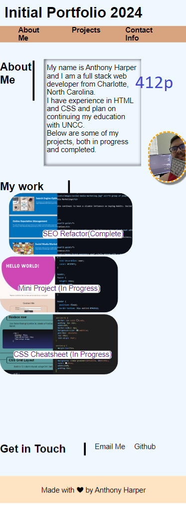
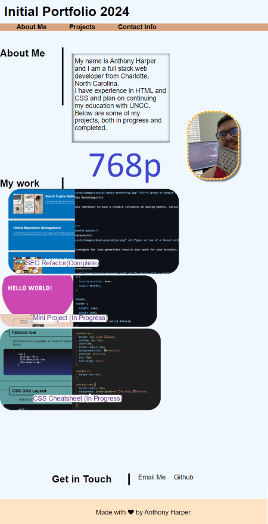

# MY FIRST PORTFOLIO

## Intro

This webpage is to serve as an online portfolio that was developed from scratch. It shows off notable projects and works done by the author and provides methods of contact. It can be displayed on desktop and laptop viewports as well as most tablets and phones with medium to small viewports.

## Usage
The navigation links at the header of the page will scroll the browser into focus of each category. 

On desktop or laptop viewports, hovering over the image in the "My Work" section to see the title. Click anywhere on the image and a new tab will appear with the project's website. 

Contact information can be found in the last section of the webpage. The Author's  email and link to Github will be found by clicking either "Email Me" or "Github".

## URL

[Live URL](https://aharper2568.github.io/my-first-portfolio/) \
[GitHub Repo](https://github.com/aharper2568/my-first-portfolio)

## Screenshots with different viewports

## Author
**Anthony Harper** \
I developed this website in VScode.

